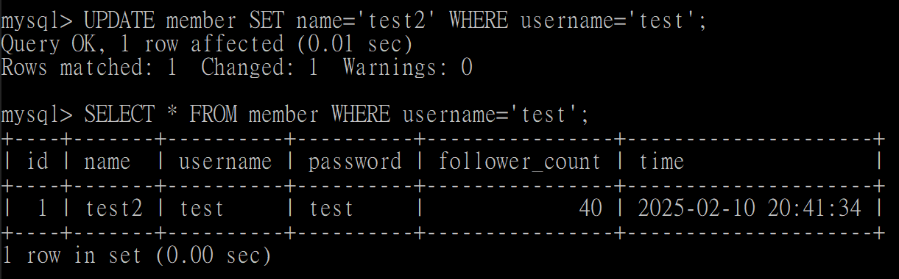

# Task 2

> **Create a new database named website.**

    CREATE DATABASE website;
    SHOW DATABASES;
    USE website;

---

> **Create a new table named member, in the website database, designed as below:**

    CREATE TABLE member(
        id BIGINT PRIMARY KEY AUTO_INCREMENT,
        name VARCHAR(255) NOT NULL,
        username VARCHAR(255) NOT NULL,
        password VARCHAR(255) NOT NULL,
        follower_count INT UNSIGNED NOT NULL DEFAULT 0,
        time DATETIME NOT NULL DEFAULT CURRENT_TIMESTAMP
    );
    SHOW TABLES;

---

# Task 3

> **INSERT a new row to the member table where name, username and password must be set to test. INSERT additional 4 rows with arbitrary data.**

    INSERT INTO member(name, username, password, follower_count)
    VALUES('test', 'test', 'test', 40);
    INSERT INTO member(name, username, password, follower_count)
    VALUES('ethan', 'ethan', 'ethan', 35);
    INSERT INTO member(name, username, password, follower_count)
    VALUES('peter', 'peter', 'peter', 15);
    INSERT INTO member(name, username, password, follower_count)
    VALUES('henry', 'henry', 'henry', 20);
    INSERT INTO member(name, username, password, follower_count)
    VALUES('emma', 'emma', 'emma', 100);

---

> **SELECT all rows from the member table.**

    SELECT * FROM member;

---

> **SELECT all rows from the member table, in descending order of time.**

    SELECT * FROM member ORDER BY time DESC;

---

> **SELECT total 3 rows, second to fourth, from the member table, in descending order of time.**

    SELECT * FROM member ORDER BY time DESC LIMIT 3 OFFSET 1;

---

> **SELECT rows where username equals to test.**

    SELECT * FROM member WHERE username='test';

---

> **SELECT rows where name includes the es keyword.**

    SELECT * FROM member WHERE name LIKE '%es%';

---

> **SELECT rows where both username and password equal to test.**

    SELECT * FROM member WHERE username='test' AND password='test';

---

> **UPDATE data in name column to test2 where username equals to test.**

    UPDATE member SET name='test2' WHERE username='test';
    SELECT * FROM member WHERE username='test';

---

# Task 4

> **SELECT how many rows from the member table.**

    SELECT COUNT(id) FROM member;

---

> **SELECT the sum of follower_count of all the rows from the member table.**

    SELECT SUM(follower_count) FROM member;

---

> **SELECT the average of follower_count of all the rows from the member table.**

    SELECT AVG(follower_count) FROM member;

---

> **SELECT the average of follower_count of the first 2 rows, in descending order of follower_count, from the member table.**

    SELECT AVG(follower_count)
    FROM (SELECT * FROM member ORDER BY follower_count DESC LIMIT 2)
    AS top_two;

---

# Task 5

> **Create a new table named message, in the website database. designed as below:**

    CREATE TABLE message(
        id BIGINT PRIMARY KEY AUTO_INCREMENT,
        member_id BIGINT NOT NULL,
        content VARCHAR(255) NOT NULL,
        like_count INT UNSIGNED NOT NULL DEFAULT 0,
        time DATETIME NOT NULL DEFAULT CURRENT_TIMESTAMP,
        FOREIGN KEY (member_id) REFERENCES member(id)
    );
    SHOW TABLES;

---

> **SELECT all messages, including sender names. We have to JOIN the member table to get that.**

    INSERT INTO message(member_id, content, like_count) VALUES(1, 'lorem', 4);
    INSERT INTO message(member_id, content, like_count) VALUES(2, 'lorem', 10);
    INSERT INTO message(member_id, content, like_count) VALUES(3, 'lorem', 1);
    INSERT INTO message(member_id, content, like_count) VALUES(4, 'lorem', 5);
    INSERT INTO message(member_id, content, like_count) VALUES(5, 'lorem', 30);
    INSERT INTO message(member_id, content, like_count) VALUES(1, 'lorem', 23);
    INSERT INTO message(member_id, content, like_count) VALUES(2, 'lorem', 21);
    INSERT INTO message(member_id, content, like_count) VALUES(3, 'lorem', 7);
    SELECT *
    FROM message JOIN member
    ON message.member_id=member.id;

---

> **SELECT all messages, including sender names, where sender username equals to test. We have to JOIN the member table to filter and get that.**

    SELECT *
    FROM message JOIN member
    ON message.member_id=member.id
    WHERE member.username='test';

---

> **Use SELECT, SQL Aggregation Functions with JOIN statement, get the average like count of messages where sender username equals to test.**

    SELECT AVG(like_count)
    FROM message JOIN member
    ON message.member_id=member.id
    WHERE member.username='test';

---

> **Use SELECT, SQL Aggregation Functions with JOIN statement, get the average like count of messages GROUP BY sender username.**

    SELECT member.username, AVG(like_count)
    FROM message JOIN member
    ON message.member_id=member.id
    GROUP BY member.username;

---
